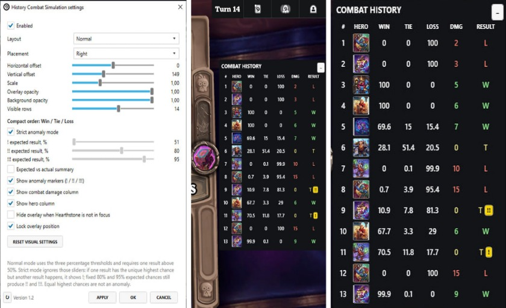

# History Combat Simulation

HistoryCombatSimulation lets you compare each Solo Battlegrounds combat result with Bob's Buddy's predicted win, tie, and loss chances.

It is a plugin for [Hearthstone Deck Tracker](https://github.com/HearthSim/Hearthstone-Deck-Tracker) that displays the current match's combat history in a configurable overlay.

The plugin supports the Windows version of HDT.

## Features

* Shows the combat turn, opponent hero, Bob's Buddy win, tie, and loss chances, and the actual result
* Optional combat damage column
* Normal and compact layouts
* Configurable anomaly markers for results that differ from the most likely simulated outcome
* Configurable number of visible rows
* Keeps combat history in memory only

## How to use

Enable the plugin and start a Solo Battlegrounds match.

The plugin reads the Bob's Buddy results already generated by HDT. It does not run a separate combat simulation.

Your completed combat history remains visible after the match. It is cleared when the next match starts.

## Anomaly markers

An anomaly marker appears when the most likely simulated result does not happen.

In the default strict mode:

* `!` means the actual result differed from the single most likely result
* `!!` means the expected result had at least an 80% chance
* `!!!` means the expected result had at least a 95% chance

No marker is shown when two or more results share the highest chance.

Normal mode uses configurable percentage thresholds and only marks an anomaly when one result has more than a 50% chance.

These markers show how unusual a result was according to the simulation. They do not suggest that the game is manipulated, broken, or unfair.

## Missing simulation data

HistoryCombatSimulation only accepts complete win, tie, and loss percentages from Bob's Buddy.

Empty, incomplete, malformed, and inequality-based results are left blank instead of being displayed as zeroes.

Recovery also requires an observed Bob's Buddy reset for the bound combat. Repeated identical percentages alone do not confirm that they belong to that combat. If the reset was missed during a reconnect or late attachment, probabilities and anomaly markers remain empty until a new reset and complete result are observed for that combat.

The plugin supports Solo Battlegrounds. Partial Duo simulations are ignored.

## Configuration

Open:

`Options -> Tracker -> Plugins -> History Combat Simulation -> Settings`

Available settings include:

* Normal or compact layout
* Left or right placement
* Horizontal and vertical offsets
* Overlay size
* Overlay opacity
* Full, header-only, or transparent background
* Background opacity
* Number of visible rows
* Strict anomaly mode
* Custom anomaly thresholds
* Expected versus actual summary
* Anomaly markers
* Combat damage column
* Hero portrait column
* Overlay preview
* Hide when Hearthstone is not in focus
* Overlay position lock
* Reset visual settings

You can move the overlay by dragging it while its position is unlocked.

When there is no combat history, unlocking the overlay shows a preview so you can configure its position before starting a match.

## Installation

Download the latest release:

https://github.com/numbereleven-a/HDT-HistoryCombatSimulation/releases/latest

Then install it using either of the standard HDT plugin methods below.

### Drag and drop

1. Open `Options -> Tracker -> Plugins`
2. Drag the downloaded `.zip` file into the plugins window
3. Restart HDT
4. Enable `History Combat Simulation`

### Manual installation

1. Extract `HistoryCombatSimulation.dll` from the release archive into `%appdata%\HearthstoneDeckTracker\Plugins\HistoryCombatSimulation`
2. Restart HDT
3. Enable `History Combat Simulation` in `Options -> Tracker -> Plugins`

If the plugin does not appear, right-click `HistoryCombatSimulation.dll`, open `Properties`, and select `Unblock`.

## Download

